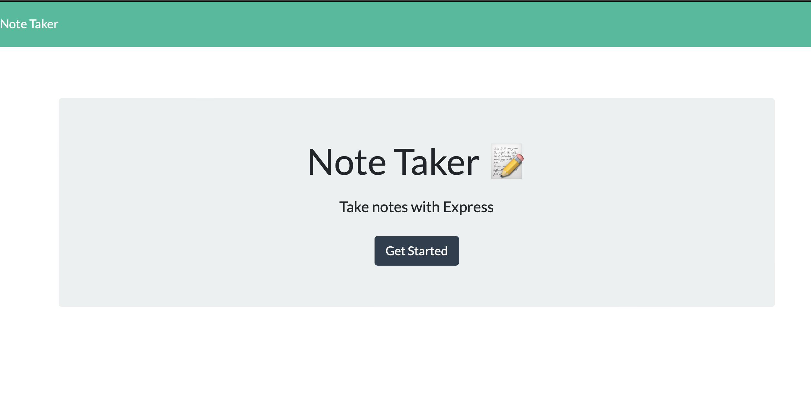
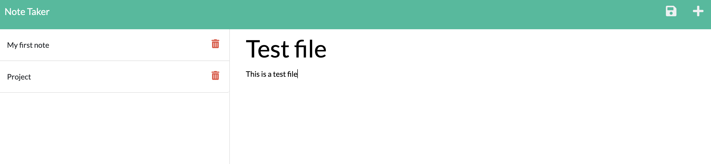
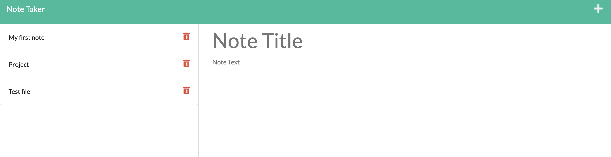

## NOTE-TAKER APPLICATION

## DESCRIPTION

To devolop an application for the user to write and save notes to keep track of all the tasks.

##DEPLOYED WEBPAGE LINK

[NOTE-TAKER](https://priyanka-notetaker.herokuapp.com)

## INSTALLATION

1. npm i or npm install express is installed before testing the code in the local server.

2. Heroku is installed to deploy the webpage .

## USAGE

When the user open the Note Taker application,then the user is presented with a landing page with a link to a notes page.

When the user click on the link to the notes page,then the user is presented with a page with existing notes listed in the left-hand column, plus empty fields to enter a new note title and the note’s text in the right-hand column.

When the user enter a new note title and the note’s text,then a Save icon 💾 appears in the navigation at the top of the page.

When the user click on the Save icon 💾 ,then the new note that is entered is saved and appears in the left-hand column with the other existing notes.

When the user click on an existing note in the list in the left-hand column,then that note appears in the right-hand column.

When the user click on the plus icon ➕ in the navigation at the top of the page,then the user presented with empty fields to enter a new note title and the note’s text in the right-hand 
column.

## TESTING

node index.js is used to test the application.

## SCREENSHOTS

1. Screenshot of the note-taker application home page

2. Screenshot of the note-taker application while entering sample note-tile and note text 

3. Screenshot of the note-taker app after entering sample data

## WALKTHROUGH VIDEO DEMO

https://github.com/priyankav89/Note-taker/assets/127457597/cf8e1e9f-67c9-4d8a-aa90-2406a9c44fb0

## CREDITS

REFRENCES

1. https://devcenter.heroku.com/articles/getting-started-with-nodejs?singlepage=true
2. https://developer.mozilla.org/en-US/docs/Learn/Server-side/Express_Nodejs/Introduction

## LICENSE

